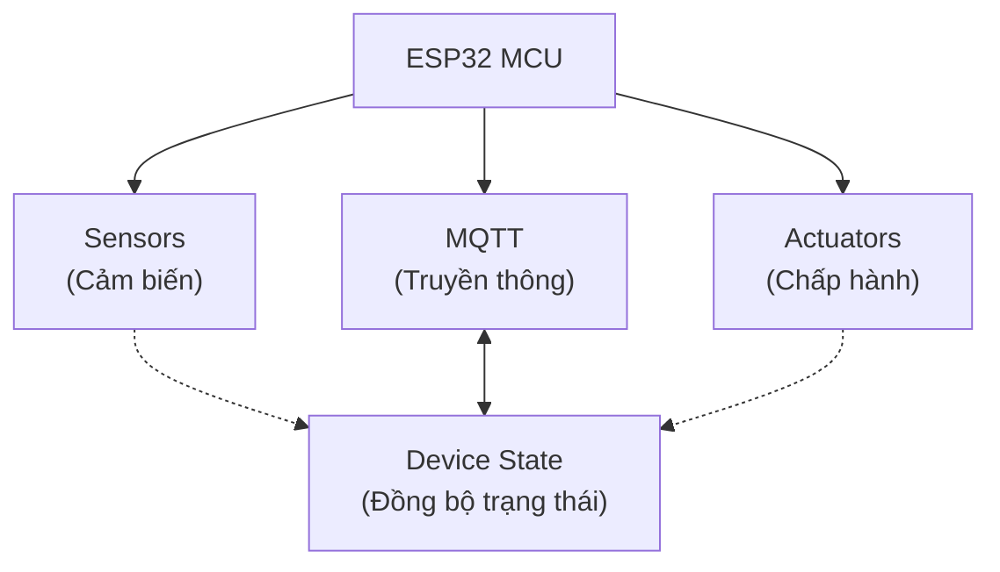
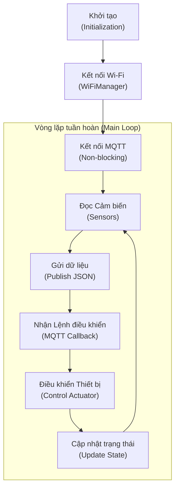

# PHẦN 2.3.1. ESP32 FIRMWARE IMPLEMENTATION

## 1. Trừu tượng hóa Phần cứng (Hardware Abstraction)

ESP32 đóng vai trò là bộ điều khiển trung tâm (Microcontroller Unit - MCU), thực hiện nhiệm vụ đọc dữ liệu từ các cảm biến, xử lý điều khiển cơ cấu chấp hành, quản lý kết nối không dây WiFi/MQTT và duy trì trạng thái hệ thống.

Sơ đồ mô tả luồng hoạt động phần cứng của node IoT:



**Các nhiệm vụ chính của ESP32:**
*   **Đọc cảm biến (Sensors):** Thu thập dữ liệu từ các cảm biến nhiệt độ & độ ẩm (DHT22), ánh sáng (LDR), chuyển động (PIR), và khoảng cách (Ultrasonic).
*   **Điều khiển thiết bị chấp hành (Actuators):** Điều khiển Relay (Đèn 1, Đèn 2, Khóa cửa) và màn hình LCD I2C hiển thị thông tin cục bộ.
*   **Giao tiếp Wi-Fi:** Tự động kết nối hoặc phát cấu hình qua thư viện `WiFiManager`.
*   **Giao tiếp MQTT:** Gửi dữ liệu cảm biến và nhận lệnh điều khiển thông qua giao thức MQTT.
*   **Cập nhật trạng thái:** Đồng bộ trạng thái thực của các thiết bị chấp hành về trung tâm quản lý openHAB.

---

## 2. Kiến trúc Firmware (Firmware Architecture)

Firmware được viết bằng ngôn ngữ Arduino C++ dựa trên mô hình hướng đối tượng (OOP) và lập trình không đồng bộ (non-blocking). 

Chu trình hoạt động của hệ thống được biểu diễn qua lưu đồ sau:



### Cơ chế kết nối lại (Reconnect) và xử lý lỗi đáng chú ý:
*   **Kết nối lại MQTT không chặn dòng (Non-blocking Reconnect):** Thay vì sử dụng vòng lặp `while(!client.connected())` làm nghẽn toàn bộ hoạt động của chip khi mất mạng, firmware sử dụng bộ đếm thời gian `millis()` để thử lại sau mỗi 5 giây. Thiết bị vẫn tiếp tục đọc cảm biến và hiển thị LCD cục bộ bình thường trong thời gian mất mạng.
*   **Cơ chế chống treo khi mất cảm biến (Sensor Timeout):** Đối với cảm biến siêu âm, hàm `pulseIn()` được thiết lập giới hạn thời gian chờ (timeout) là `30.000 µs`. Nếu cảm biến bị đứt dây hoặc hỏng, hệ thống sẽ trả về lỗi `-1` và đi tiếp thay vì bị treo cứng CPU.
*   **Bộ lọc nhiễu tín hiệu (LDR Moving Average Filter):** Sử dụng bộ lọc trung bình trượt (kích thước `N = 5`) để làm mịn dữ liệu ánh sáng đọc từ chân Analog, tránh gây nhiễu lệnh logic điều khiển bật/tắt đèn ở cổng openHAB.

---

## 3. Mã nguồn tiêu biểu (Representative Code Snippet)

### 3.1. Xử lý nhận lệnh và phản hồi trạng thái qua MQTT
Khi có lệnh từ server gửi xuống, hàm callback sẽ phân tích và chuyển đến đúng thiết bị đích, sau đó gửi trả ngay trạng thái thực tế lên MQTT Broker để đồng bộ:

Xem chi tiết trong: [SmartHomeNode.cpp](../firmware/SmartHomeNode.cpp#L53)

```cpp
void SmartHomeNode::handleMqttMessage(String topic, String payload) {
  if (mqttClient == nullptr) return;
  
  for (int i = 0; i < actuatorCount; i++) {
    String subTopic;
    actuators[i]->getSubscribeTopic(subTopic, config.room_name);
    
    // Khớp topic nhận lệnh của thiết bị chấp hành
    if (topic == subTopic) {
      actuators[i]->handleCommand(payload); // Thực hiện lệnh (ON/OFF)
      
      // Phản hồi lại trạng thái mới để cập nhật lên openHAB
      String stateTopic;
      actuators[i]->getStateTopic(stateTopic, config.room_name);
      mqttClient->publish(stateTopic.c_str(), actuators[i]->getState().c_str(), true);
      
      // Hiển thị trạng thái thay đổi lên màn hình LCD
      if (lcdMod != nullptr && actuators[i]->getName() != "lcd") {
        lcdMod->showStatus("Node: " + String(config.room_name), 
                           actuators[i]->getName() + ": " + actuators[i]->getState());
      }
      break;
    }
  }
}
```

### 3.2. Đóng gói dữ liệu cảm biến định dạng JSON gửi định kỳ
Các cảm biến được đọc đồng thời và đóng gói chung vào một gói tin JSON để tối ưu hóa số lượng kết nối mạng:

Xem chi tiết trong: [esp32_openhab.ino](../firmware/esp32_openhab.ino#L125)

```cpp
// Trích xuất từ hàm loop() chính
unsigned long now = millis();
if (now - lastSensorRead >= sensorReadInterval) { // Chu kỳ 3 giây
  lastSensorRead = now;
  
  if (node.getSensorCount() > 0) {
    StaticJsonDocument<300> doc;
    node.readAllSensors(doc); // Đọc toàn bộ cảm biến đang có vào JSON
    
    if (client.connected()) {
      char buffer[300];
      serializeJson(doc, buffer);
      
      String pubTopic = String("home/") + config.room_name + "/sensors";
      client.publish(pubTopic.c_str(), buffer); // Gửi gói tin lên MQTT Broker
    }
  }
}
```
