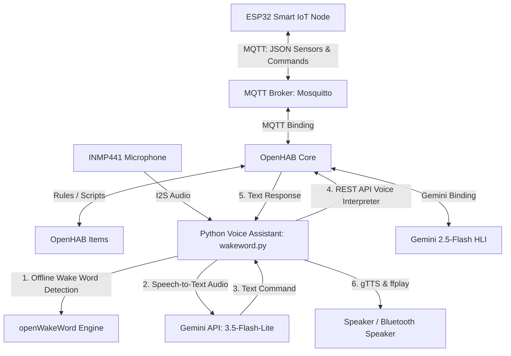

# TÀI LIỆU TRIỂN KHAI OPENHAB (OPENHAB IMPLEMENTATION)

Hệ thống nhà thông minh SIC-IOT sử dụng **OpenHAB** làm nền tảng trung tâm (Smart Home Platform) để kết nối, quản lý các thiết bị IoT (ESP32), thực thi các kịch bản tự động hóa và tích hợp trợ lý ảo thông minh sử dụng mô hình ngôn ngữ lớn **Gemini AI**.

---

## 1. Kiến trúc Tổng quan của Hệ thống (System Architecture)

Luồng truyền thông tin và điều khiển trong hệ thống được vận hành như sau:

---

## 2. Các thành phần Cấu hình OpenHAB

Cấu hình của OpenHAB được định nghĩa thông qua các tệp cấu hình dạng khai báo (declarative config files) đặt trong thư mục `openhab/`.

### 2.1. Cấu hình Thiết bị (Things - `/openhab/things/`)
*   [mqtt.things](../openhab/things/mqtt.things):
    *   **MQTT Broker Bridge:** Kết nối tới MQTT Broker cục bộ (`127.0.0.1:1883`).
    *   **ESP32 Thing (`965707a924`):**
        *   **Cảm biến (State Channels):** Đọc chuỗi JSON từ topic `home/esp32/sensors`, sử dụng `JSONPATH` để tách thành các kênh: Nhiệt độ (`$.temp`), Độ ẩm (`$.humi`), Chuyển động (`$.pir`), Khoảng cách (`$.distance`), Ánh sáng (`$.light`).
        *   **Cơ cấu chấp hành (Command Channels):** Gửi lệnh điều khiển trực tiếp tới các topic `home/esp32/relay_light` (Đèn khách), `home/esp32/relay_light_bedroom` (Đèn ngủ), `home/door` (Cửa tự động), và `home/esp32/heater` (Bình nóng lạnh).
    *   **Astro Binding:** Cấu hình theo dõi chu kỳ mặt trời và mặt trăng tại vị trí địa lý của hệ thống.
*   [gemini.things](../openhab/things/gemini.things):
    *   Tích hợp Gemini AI (`gemini-2.5-flash`) thông qua kênh `chat`.
    *   **System Prompt:** Giới hạn vai trò của Gemini chỉ điều khiển hoặc trả lời về các thiết bị có sẵn trong hệ thống (Đèn LED, Cửa, Bình nóng lạnh, Cảm biến nhiệt độ/độ ẩm/ánh sáng/chuyển động/khoảng cách) và cấm tự bịa ra các thiết bị không tồn tại (TV, Rèm cửa, Điều hòa, Quạt).

### 2.2. Định nghĩa Items (`/openhab/items/`)
*   [home.items](../openhab/items/home.items): Gắn các kênh (channels) của Thing với các Item trong OpenHAB để hiển thị lên UI và áp dụng logic.
    *   *Cảm biến:* `Nhiet_Do`, `Do_Am`, `Cam_Bien_CHuyen_Dong`, `Cam_Bien_Anh_Sang`, `Cam_Bien_Khoang_Cach`.
    *   *Điều khiển:* `ESP32_Den_LED` (Dimmer), `ESP32_Den_LED_phong_ngu` (Dimmer), `ESP32_Cua_Tu_Dong` (Switch), `ESP32_Binh_nong_lanh` (Switch).
    *   *Biến cờ logic:* `Flag_Khong_Bat_Binh` (Dùng để bỏ qua việc bật bình nóng lạnh tự động nếu trời nóng).
*   [gemini.items](../openhab/items/gemini.items): Định nghĩa `GeminiChat` kết nối với kênh chat của Gemini để lưu trữ nội dung đối thoại và phản hồi.

### 2.3. Sơ đồ giao diện (Sitemaps - `/openhab/sitemaps/`)
*   [default.sitemap](../openhab/sitemaps/default.sitemap): Tạo giao diện điều khiển (Basic UI/App) trực quan được chia làm 5 vùng chức năng chính:
    1.  **Phòng Khách:** Điều khiển độ sáng đèn và xem nhiệt độ/độ ẩm.
    2.  **Phòng Ngủ:** Điều khiển độ sáng đèn và đóng/mở cửa phòng ngủ.
    3.  **Nhà Vệ Sinh:** Bật/tắt bình nóng lạnh và hiển thị trạng thái cờ hủy tự động.
    4.  **Cảm Biến Môi Trường:** Xem trực quan các thông số từ cảm biến ánh sáng, chuyển động và khoảng cách.
    5.  **Trợ Lý Ảo Gemini:** Hiển thị câu phản hồi text mới nhất của Gemini.

---

## 3. Kịch bản Tự động hóa (Automation Rules - `/openhab/rules/`)

Các kịch bản được viết bằng ngôn ngữ OpenHAB Rules DSL trong tệp [automation.rules](../openhab/rules/automation.rules):

1.  **Mở cửa tự động:** Khi phát hiện chuyển động (`Cam_Bien_CHuyen_Dong` chuyển sang `ON`), cửa tự động mở (`ESP32_Cua_Tu_Dong` gửi lệnh `ON`) và tự động đóng lại sau 10 giây thông qua hàm `createTimer`.
2.  **Đèn phòng ngủ theo giờ:** Tự động điều khiển độ sáng của đèn ngủ ở mức 70% trong khung giờ từ 19:00 đến 23:00 hàng ngày, ngoài thời gian này sẽ tắt.
3.  **Đèn phòng khách thông minh:** 
    *   Từ 17h đến 24h: Bật sáng tối đa 100%.
    *   Từ 0h đến 6h sáng: Giảm độ sáng xuống 50% để tiết kiệm điện.
    *   Khung giờ ban ngày: Dựa vào cảm biến ánh sáng. Nếu cường độ ánh sáng môi trường nhỏ hơn 100 lux thì tự động bật đèn 100%, ngược lại sẽ tắt đèn.
4.  **Hệ thống đun nước thông minh (Smart Water Heater):**
    *   Lúc **15:00**: Kiểm tra nhiệt độ ngoài trời. Nếu nhiệt độ $> 35.0^\circ\text{C}$ thì tự động bật cờ `Flag_Khong_Bat_Binh` lên `ON`.
    *   Lúc **17:00**: Thực hiện bật bình nóng lạnh tự động, nhưng chỉ kích hoạt nếu cờ `Flag_Khong_Bat_Binh` đang ở trạng thái `OFF` (giúp tiết kiệm điện năng khi thời tiết oi bức).
    *   Lúc **19:00**: Tự động tắt bình nóng lạnh để đảm bảo an toàn.

---

## 4. Tích hợp Trợ lý Giọng nói Offline (Voice Assistant & Gemini)

Cơ chế điều khiển bằng giọng nói tiếng Việt được thực hiện bởi script Python [wakeword.py](../python/wakeword.py) chạy độc lập trên máy chủ điều khiển (ví dụ: Raspberry Pi):

1.  **Phát hiện từ khóa gọi (Wake Word):** Lắng nghe dữ liệu âm thanh từ Microphone I2S (INMP441). Sử dụng thư viện `openwakeword` để phát hiện các từ khóa *"Alexa"* hoặc *"Hey Jarvis"* trực tiếp ngoại tuyến (offline) trên chip mà không cần gửi dữ liệu liên tục lên cloud.
2.  **Nhận dạng giọng nói (Speech-To-Text - STT):** Sau khi kích hoạt bởi từ khóa, hệ thống sẽ thu âm câu lệnh trong vòng 5 giây tiếp theo, hạ tần số lấy mẫu xuống 16kHz, chuyển đổi base64 và gửi lên mô hình `gemini-3.5-flash-lite` để nhận dạng chính xác nội dung văn bản tiếng Việt của câu lệnh.
3.  **Xử lý Ngôn ngữ & Điều khiển (Natural Language Understanding - NLU):** Văn bản câu lệnh được gửi tới REST API Voice Interpreter của OpenHAB tại endpoint `/rest/voice/interpreters/gemini`. 
    *   OpenHAB sẽ chuyển tiếp văn bản này đến Thing `gemini:account:myaccount`.
    *   Nhờ có cấu hình System Prompt và liên kết Channel chặt chẽ, Gemini phân tích câu lệnh của người dùng, tự động thay đổi trạng thái của các Item tương ứng (ví dụ: gửi lệnh `ON` tới `ESP32_Den_LED` khi nói *"bật đèn phòng khách"*).
    *   Gemini trả lại câu phản hồi xác nhận hành động bằng tiếng Việt (ví dụ: *"Tôi đã bật đèn phòng khách cho bạn rồi nhé!"*).
4.  **Phản hồi bằng giọng nói (Text-To-Speech - TTS):** Script Python nhận phản hồi dạng văn bản từ OpenHAB, sử dụng thư viện `gTTS` để sinh âm thanh tiếng Việt và dùng công cụ `ffplay` để phát ra loa, hoàn tất chu trình giao tiếp tự nhiên với người dùng.
